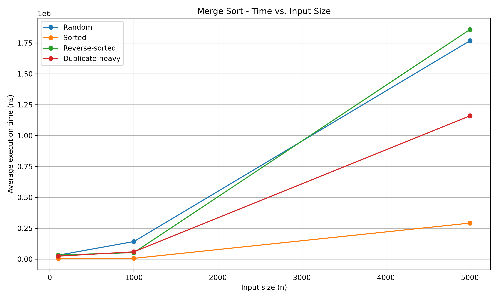
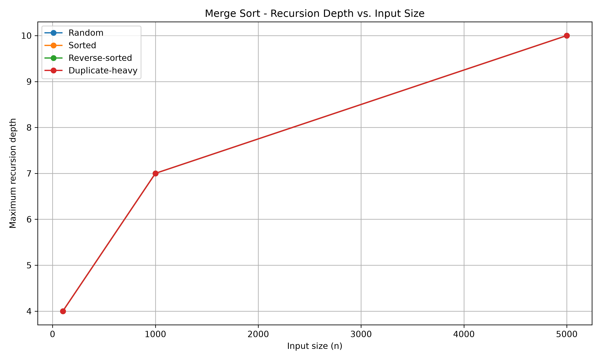
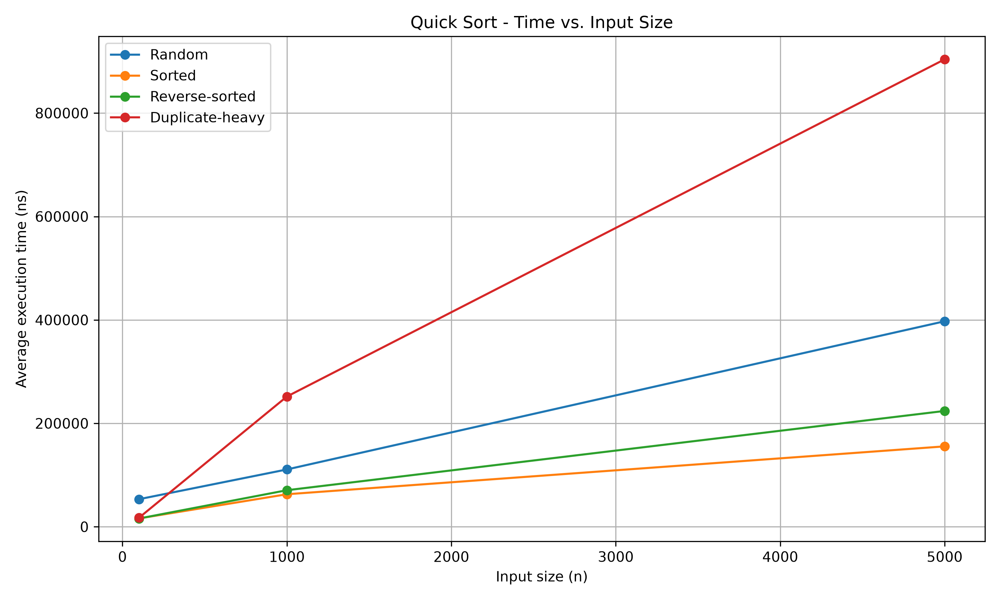
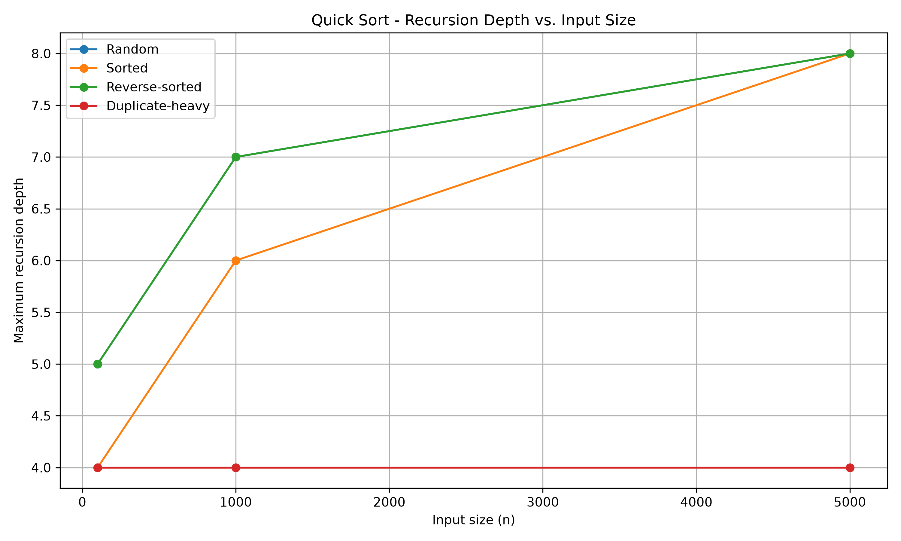
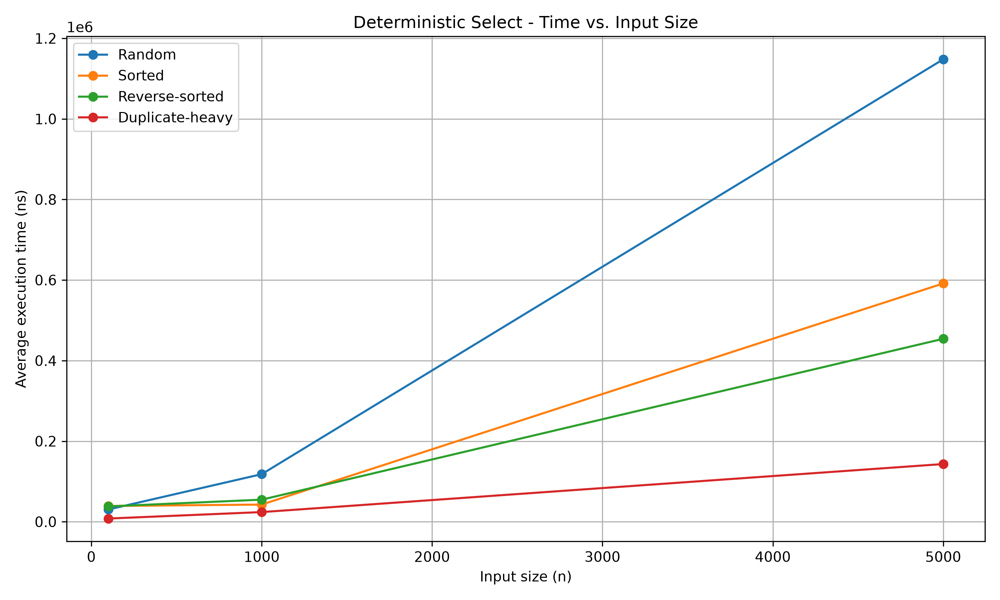
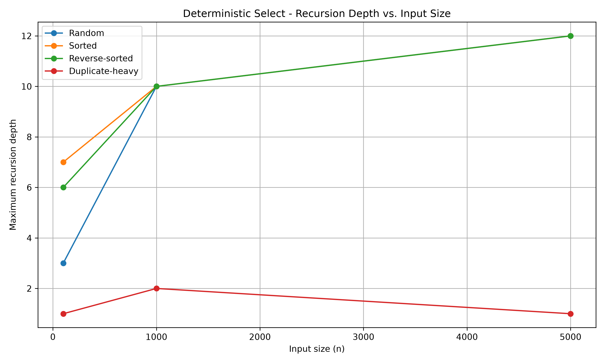
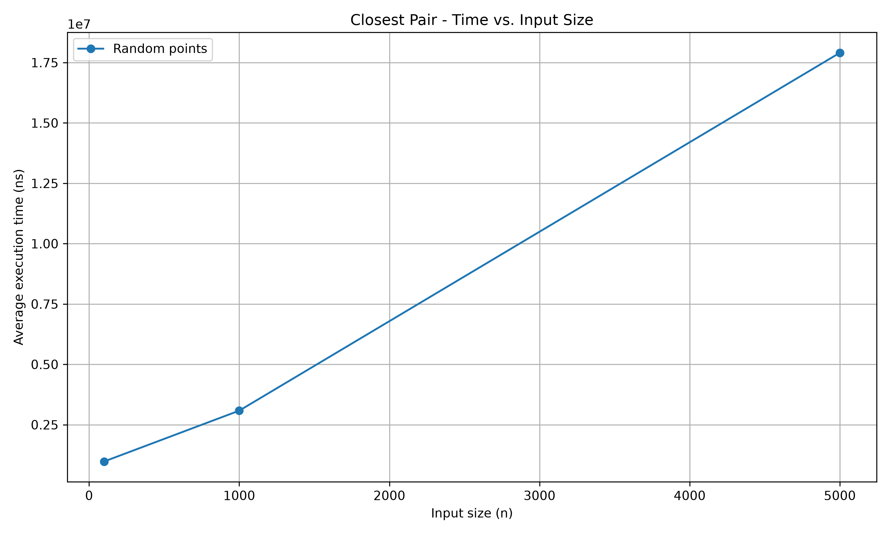
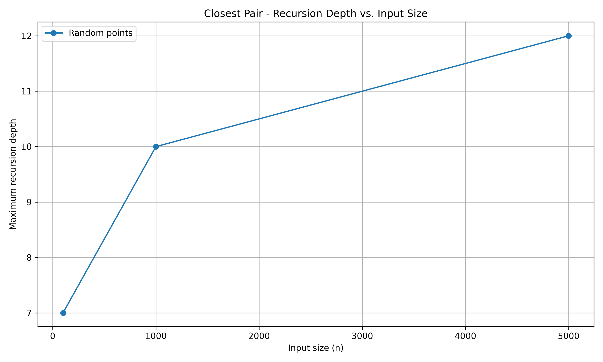

# DAA Assignment 1 — Divide and Conquer Algorithms

## 1. Overview

This project implements and analyzes four divide-and-conquer algorithms:

- Merge Sort
- Randomized Quick Sort
- Deterministic Select using Median-of-Medians
- Closest Pair of Points

The main goal of this assignment is to implement the algorithms, test their correctness, and study their practical performance.

The experiments measure execution time, maximum recursion depth, comparisons, and swaps where applicable.

---

## 2. Algorithms

### 2.1 Merge Sort

Merge Sort divides the array into two smaller parts, sorts both parts recursively, and then merges them.

Time complexity:

- Best case: O(n log n)
- Average case: O(n log n)
- Worst case: O(n log n)

Space complexity: O(n).

### 2.2 Randomized Quick Sort

Randomized Quick Sort selects a random pivot and partitions the array around the pivot.

The implementation recursively processes the smaller partition and handles the larger partition iteratively.

Expected time complexity: O(n log n).

Worst-case time complexity: O(n²).

### 2.3 Deterministic Select

Deterministic Select finds the k-th smallest element using the Median-of-Medians method.

The algorithm divides the elements into groups of five, finds their medians, selects a pivot, and partitions the array.

Worst-case time complexity: O(n).

### 2.4 Closest Pair of Points

The Closest Pair algorithm finds the two points with the smallest Euclidean distance.

It uses a divide-and-conquer approach by dividing the points into two parts and checking the points near the middle line.

Time complexity: O(n log n).

---

## 3. Implementation

The main Java classes are:

- `MergeSorter.java`
- `QuickSorter.java`
- `DeterministicSelector.java`
- `ClosestPairSolver.java`
- `InputGenerator.java`
- `Point.java`
- `Experiment.java`

JUnit tests are also included for the implemented algorithms.

The `Experiment` class is used to measure the performance of the algorithms.

Execution time is measured using `System.nanoTime()`.

Each experiment is run five times, and the average execution time is recorded.

---

## 4. Experimental Setup

Three input sizes were tested:

- 100
- 1000
- 5000

For Merge Sort, Randomized Quick Sort, and Deterministic Select, four input types were tested:

- Random
- Sorted
- Reverse-sorted
- Duplicate-heavy

For Closest Pair, randomly generated two-dimensional points were used.

Each test was run 5 times.

The following measurements were recorded:

- Average execution time
- Maximum recursion depth
- Number of comparisons
- Number of swaps where applicable

The experimental results are stored in:

`docs/results/results.csv`

---

## 5. Experimental Results

### 5.1 Execution Time

The following table shows the average execution time in nanoseconds.

| Algorithm | Input Type | n=100 | n=1000 | n=5000 |
|---|---|---:|---:|---:|
| Merge Sort | Random | 31,880 | 142,200 | 1,767,860 |
| Merge Sort | Sorted | 5,780 | 6,060 | 291,640 |
| Merge Sort | Reverse-sorted | 32,940 | 52,960 | 1,858,540 |
| Merge Sort | Duplicate-heavy | 24,020 | 59,200 | 1,159,840 |
| Quick Sort | Random | 53,260 | 110,820 | 397,420 |
| Quick Sort | Sorted | 16,080 | 62,880 | 155,460 |
| Quick Sort | Reverse-sorted | 15,900 | 70,660 | 223,980 |
| Quick Sort | Duplicate-heavy | 17,280 | 251,840 | 904,020 |
| Deterministic Select | Random | 30,400 | 118,100 | 1,147,940 |
| Deterministic Select | Sorted | 39,080 | 42,620 | 591,520 |
| Deterministic Select | Reverse-sorted | 38,080 | 54,780 | 454,120 |
| Deterministic Select | Duplicate-heavy | 7,960 | 23,980 | 143,220 |
| Closest Pair | Random points | 975,760 | 3,081,760 | 17,905,700 |

### 5.2 Recursion Depth

The following table shows the maximum recursion depth recorded during the experiments.

| Algorithm | Input Type | n=100 | n=1000 | n=5000 |
|---|---|---:|---:|---:|
| Merge Sort | Random | 4 | 7 | 10 |
| Merge Sort | Sorted | 4 | 7 | 10 |
| Merge Sort | Reverse-sorted | 4 | 7 | 10 |
| Merge Sort | Duplicate-heavy | 4 | 7 | 10 |
| Quick Sort | Random | 5 | 7 | 8 |
| Quick Sort | Sorted | 4 | 6 | 8 |
| Quick Sort | Reverse-sorted | 5 | 7 | 8 |
| Quick Sort | Duplicate-heavy | 4 | 4 | 4 |
| Deterministic Select | Random | 3 | 10 | 12 |
| Deterministic Select | Sorted | 7 | 10 | 12 |
| Deterministic Select | Reverse-sorted | 6 | 10 | 12 |
| Deterministic Select | Duplicate-heavy | 1 | 2 | 1 |
| Closest Pair | Random points | 7 | 10 | 12 |

---

## 6. Plots

The experiments produced plots for execution time and recursion depth.

### Merge Sort





### Randomized Quick Sort





### Deterministic Select





### Closest Pair





---

## 7. Results for Different Input Types

Four input types were used: random, sorted, reverse-sorted, and duplicate-heavy.

Merge Sort showed relatively stable behavior for different input types because its main process does not strongly depend on the original order of the elements.

Quick Sort showed larger differences between input types. The duplicate-heavy input produced a large number of comparisons because many elements had the same value as the pivot.

Deterministic Select also showed differences between input types. Its three-way partitioning helps process elements equal to the pivot together.

Closest Pair was tested using randomly generated points.

---

## 8. Operation Counts

The experiments also recorded comparisons and swaps where applicable.

For Merge Sort, comparisons were counted during the merge process.

For Quick Sort, both comparisons and swaps were counted during partitioning.

For Deterministic Select, comparisons and swaps were counted during sorting, pivot selection, and partitioning.

For Closest Pair, distance-related comparisons were counted.

These measurements help show how much work each algorithm performs internally.

---

## 9. Analysis

The experiment showed that execution time generally increases when the input size becomes larger.

Merge Sort showed predictable recursion depth as the input size increased.

Randomized Quick Sort had different results for different input types. The duplicate-heavy input produced a large number of comparisons.

Deterministic Select showed controlled recursion because it uses the Median-of-Medians method.

Closest Pair also required more time for larger inputs, while its recursion depth increased gradually.

The graphs make these differences easier to see.

---

## 10. Conclusion

In this assignment, four divide-and-conquer algorithms were implemented and tested with different input sizes and input types.

Each test was repeated five times, and the average execution time was recorded.

Maximum recursion depth, comparisons, and swaps were also measured where applicable.

The results show that input size has a clear effect on execution time. Input type can also affect the practical performance of some algorithms, especially Quick Sort.

The CSV file and graphs provide a clear view of the experimental results and help show how the algorithms behave in practice.

---

## 11. Project Structure

```text
daa-assignment-1/
├── docs/
│   ├── plots/
│   ├── results/
│   │   └── results.csv
│   └── screenshots/
├── src/
├── plot_results.py
├── pom.xml
├── README.md
└── .gitignore